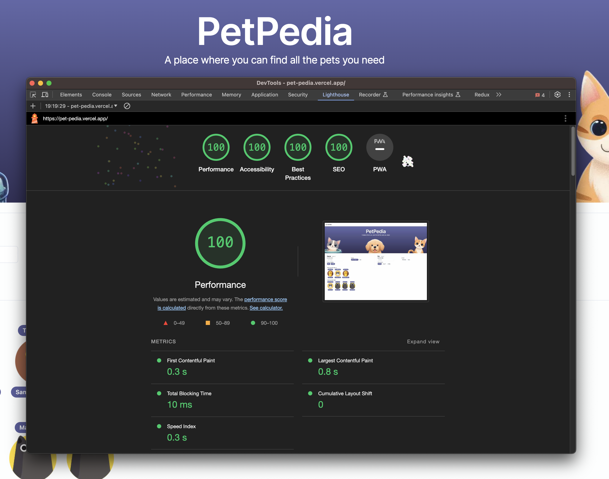

# Pet-Pedia

Run the development server (node version: 18.19.0):

```bash
npm run dev
```

## Live Demo

[View Live Demo](https://pet-pedia.vercel.app/)

## User Story

Initial [Challenge](https://github.com/Medibank/coding-challenge-web)

1. As a user, I want to filter the list of pets by type (cats, dogs, or fish).
2. As a user, I want to sort the pets within either owner's name, age, pet's name, or type by ascending or descending order.
3. As a user, I want to perform fuzzy searches for the owner's name or/and pet's name to quickly locate the specific pet.
4. As a user, I want the ability to reset my filtered/searched results.
5. As a user, I want the website to be fully functional on mobile devices.
6. As a user, I want to experience a user-friendly design with options for light and dark themes.
7. As a user, I want the website to be kid-friendly with nice animations.

## Project Details

The project has been developed using best practices in the industry 2024. For more details on the industry trends, check out [Rising Stars 2023](https://risingstars.js.org/2023/en).

### Key Details

-   Framework: Next.js with App router, TypeScript
-   UI Framework: Shadcn (ranked 1st in Frontend ecosystem)
-   Styling: Tailwind CSS (ranked 1st in CSS frameworks)
-   State Management: Zustand (ranked 1st in state management)
-   Query: TanStack Query (ranked 1st in GraphQL)
-   Additional Configurations: Prettier, ESLint, Husky, and Commitizen for standardized coding and git commit styles, ensuring code quality and consistency.

## Performance (Chrome Lighthouse)


